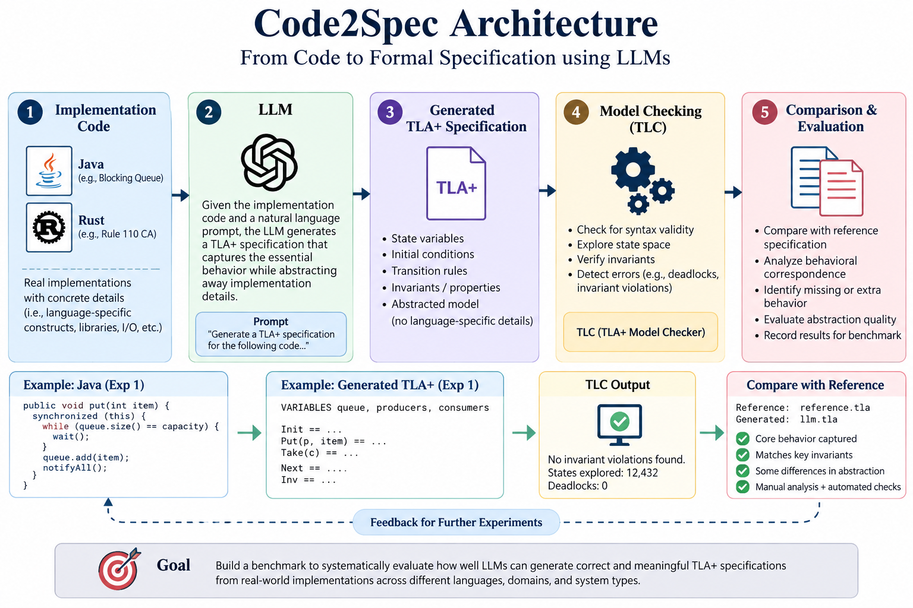

# Code2Spec: Evaluating LLM-Generated TLA+ Specifications

## Overview

This project explores whether Large Language Models (LLMs) can translate existing software implementations into TLA+ specifications that capture the essential behavioral and algorithmic properties of the original code.

The core idea is:

Implementation Code
        |
        v
       LLM
        |
        v
Generated TLA+ Specification
        |
        v
Model Checking / Comparison
        |
        v
Reference TLA+ Specification

The goal is not to perform a line-by-line translation of source code. Instead, the LLM is asked to identify the important system behavior, abstract away implementation-specific details, and express that behavior as a formal TLA+ specification.

This repository currently contains an initial set of experiments exploring this code-to-specification workflow.

---

## Architecture

  

The Code2Spec workflow takes an existing implementation, provides it to an LLM, generates an abstract TLA+ specification, and evaluates the generated specification against a reference model using formal verification and behavioral comparison.

## Motivation

LLMs are increasingly capable of generating software implementations, but generated code can be difficult to reason about formally.

This project investigates a related question:

> Given an existing implementation, can an LLM generate a TLA+ specification that captures the important behavior of that implementation?

The generated specification is compared against an existing reference specification to identify:

- Correctly captured behavior
- Missing behavior
- Additional behavior
- Different abstractions
- Differences in state representation
- Differences in safety properties and invariants

The long-term goal is to build a small benchmark for evaluating LLM-based code-to-TLA+ generation.

---

## Current Experiments

### Experiment 1: Blocking Queue

**Implementation language:** Java

The first experiment uses a bounded concurrent blocking queue implementation.

The implementation contains:

- Multiple producers and consumers
- A bounded buffer
- `put()` and `take()` operations
- Blocking when the queue is full or empty
- Java `wait()` / `notify()` synchronization
- Concurrent execution

The corresponding TLA+ model abstracts away Java-specific implementation details and represents the important system behavior using:

- Producers
- Consumers
- A bounded buffer
- A waiting set
- Put and Get operations
- Nondeterministic scheduling

### Source

The Java implementation and corresponding TLA+ example are based on the BlockingQueue material from the TLA+ learning resources.

Source:

https://learntla.com/

The reference TLA+ specification is used only for evaluation. It is not provided to the LLM during generation.

### Files

    exp1/
    ├── code.java
    ├── reference.tla
    ├── reference.cfg
    ├── llm.tla
    └── llm.cfg

---

### Experiment 2: Rule 110 Cellular Automaton

**Implementation language:** Rust

The second experiment uses a Rust implementation of a Rule 110 cellular automaton.

The relevant implementation contains:

- A finite cellular board
- `Zero`, `One`, and `None` states
- An initial configuration
- Cyclic left and right neighbors
- Rule 110 state transitions
- Partial computation of future rows
- A circular row buffer

The LLM is given the relevant Rust implementation without the reference TLA+ specification.

It is asked to generate a TLA+ specification describing the core behavior while abstracting away implementation-specific details such as rendering, GUI handling, GPU code, GIF generation, and other application-level machinery.

The generated specification models:

- Board cells
- Initial state
- Cyclic neighbors
- Rule 110 transitions
- Partially computed rows
- Nondeterministic cell updates

### Source

The Rule 110 implementation and TLA+ specification originate from Gregory Terzian's work on using TLA+ alongside AI-generated code.

Article:

https://medium.com/@polyglot_factotum/tla-in-support-of-ai-code-generation-9086fc9715c4

Original repository:

https://github.com/gterzian/automata

The reference TLA+ specification is used for evaluation and is not provided to the LLM during generation.

### Files

    exp2/
    ├── code.rs
    ├── reference.tla
    ├── reference.cfg
    ├── llm.tla
    └── llm.cfg

---

## Methodology

For each experiment, the following procedure is followed:

1. Obtain an existing implementation.
2. Obtain the corresponding reference TLA+ specification.
3. Keep the reference specification hidden from the LLM.
4. Provide the implementation code to the LLM.
5. Ask the LLM to generate a behavioral TLA+ specification.
6. Generate a configuration file for the generated specification.
7. Compare the generated specification with the reference specification.
8. Analyze differences in behavior and abstraction.

The LLM is instructed to focus on the semantics of the implementation rather than performing a direct line-by-line translation.

Implementation-specific details that do not affect the relevant behavior are intentionally abstracted away.

---

## Evaluation Criteria

The eventual benchmark will evaluate generated specifications using several criteria.

### 1. Syntax Validity

Can the generated TLA+ specification be parsed successfully?

### 2. Model-Checking Validity

Can the generated specification be executed using TLC?

### 3. Type Correctness

Does the generated model satisfy its type constraints?

### 4. Behavioral Correspondence

Does the generated specification capture behavior represented by the reference specification?

### 5. Safety Properties

Are important safety properties and invariants preserved?

### 6. Missing Behavior

Does the generated specification omit important behavior from the implementation or reference model?

### 7. Extra Behavior

Does the generated specification introduce behavior that is not supported by the implementation?

### 8. Abstraction Quality

Does the generated specification correctly abstract away implementation details while retaining important system semantics?

---

## Initial Observations

### Experiment 1: Blocking Queue

The generated specification captures the main concurrency abstractions of the Java implementation, including:

- Producers and consumers
- A bounded buffer
- Waiting threads
- Put/Get operations
- Nondeterministic scheduling

The generated model also introduces some modeling choices that differ from the reference specification. These differences are retained as part of the experiment and can be investigated through further model checking.

### Experiment 2: Rule 110

The generated specification captures the main behavioral structure of the Rust implementation, including:

- Initial board configuration
- Cyclic neighbor relationships
- Rule 110 transition logic
- Partial cell computation
- Nondeterministic update order

The generated model uses a different parameterization from the reference model and omits some higher-level refinement properties present in the reference specification.

These differences are retained as part of the evaluation rather than manually modifying the generated specification to match the reference.

---

## Project Structure

The current repository is organized as follows:

    FOSSE/
    │
    ├── exp1/
    │   ├── code.java
    │   ├── reference.tla
    │   ├── reference.cfg
    │   ├── llm.tla
    │   └── llm.cfg
    │
    ├── exp2/
    │   ├── code.rs
    │   ├── reference.tla
    │   ├── reference.cfg
    │   ├── llm.tla
    │   └── llm.cfg
    │
    └── README.md

Each experiment contains:

- `code.*` - source implementation provided to the LLM
- `reference.tla` - reference TLA+ specification
- `reference.cfg` - configuration used for the reference model
- `llm.tla` - TLA+ specification generated by the LLM
- `llm.cfg` - configuration for the generated specification

---

## Benchmark Development

The current experiments form the initial stage of a larger benchmark.

The planned benchmark will contain multiple implementation/specification pairs covering different types of systems and algorithms.

A future benchmark structure may look like:

    benchmark/
    ├── 01_blocking_queue/
    │   ├── source/
    │   ├── reference.tla
    │   └── reference.cfg
    │
    ├── 02_rule110/
    │   ├── source/
    │   ├── reference.tla
    │   └── reference.cfg
    │
    ├── 03_.../
    │   ├── source/
    │   ├── reference.tla
    │   └── reference.cfg
    │
    └── ...

Generated specifications can then be evaluated consistently across all examples.

---

## Planned Automated Evaluation

The eventual goal is to automate the evaluation pipeline:

    Source Implementation
            |
            v
        LLM Prompt
            |
            v
      Generated TLA+
            |
            v
           TLC
            |
            v
    Model-Checking Results
            |
            v
     Comparison with Reference
            |
            v
      Benchmark Results

Potential automated metrics include:

- TLA+ parsing success
- TLC execution success
- Type invariant satisfaction
- Safety invariant satisfaction
- Deadlock detection
- Behavioral correspondence
- Missing transitions
- Additional transitions
- State-space differences
- Abstraction differences

---

## TLA+

TLA+ is a formal specification language for describing the behavior of concurrent and distributed systems.

TLC can be used to explore the state space of a TLA+ specification and check properties such as invariants.

### Resources

TLA+ learning materials:

https://learntla.com/

TLA+ Foundation:

https://www.tlapl.us/

TLA+ GitHub repository:

https://github.com/tlaplus/tlaplus

---

## References and Sources

### Blocking Queue

TLA+ learning resources:

https://learntla.com/

The BlockingQueue implementation and associated specification used in Experiment 1 are derived from the BlockingQueue example provided through the TLA+ learning materials.

### Rule 110

Gregory Terzian, "TLA+ in support of AI code generation":

https://medium.com/@polyglot_factotum/tla-in-support-of-ai-code-generation-9086fc9715c4

Original repository:

https://github.com/gterzian/automata

The Rule 110 implementation and corresponding TLA+ specifications used in Experiment 2 are derived from this project.

---

## Reproducibility

Each experiment keeps the implementation, reference specification, reference configuration, generated specification, and generated configuration together.

The reference specification is not supplied to the LLM during generation.

The generated TLA+ files are preserved as produced by the LLM so that differences between generated and reference specifications can be analyzed.

As the benchmark develops, the same prompt and evaluation procedure can be applied across additional implementation/specification pairs.

---

## Current Status

**Status: Early Exploratory Benchmark**

### Completed

- [x] Initial Java BlockingQueue experiment
- [x] Reference TLA+ specification for BlockingQueue
- [x] LLM-generated TLA+ specification for BlockingQueue
- [x] Initial Rust Rule 110 experiment
- [x] Reference TLA+ specification for Rule 110
- [x] LLM-generated TLA+ specification for Rule 110
- [x] Initial manual comparison of generated and reference specifications
- [x] Initial benchmark repository structure

### In Progress

- [ ] Add more implementation/specification pairs
- [ ] Validate examples using TLC
- [ ] Automate model checking
- [ ] Automate reference/generated comparison
- [ ] Define quantitative evaluation metrics
- [ ] Create benchmark results table
- [ ] Analyze common LLM failure modes

### Future Work

- [ ] Expand the benchmark across multiple programming languages
- [ ] Evaluate multiple LLMs
- [ ] Evaluate multiple prompting strategies
- [ ] Categorize specification-generation errors
- [ ] Study behavioral equivalence between generated and reference specifications
- [ ] Release the benchmark and evaluation tooling publicly

---

## Key Research Question

The central question explored by this project is:

> **Can an LLM generate a TLA+ specification from an existing software implementation that faithfully captures the implementation's essential behavior?**

The experiments are intended to provide a structured way to investigate this question through concrete implementation/specification pairs, formal specifications, and eventually model-checking-based evaluation.

---

## Disclaimer

This repository is an exploratory research project.

The generated TLA+ specifications are experimental outputs and should not be assumed to be formally equivalent to the reference specifications solely because they appear structurally similar.

Generated specifications are preserved without manually modifying them to match the reference models before evaluation. Differences between generated and reference specifications are therefore considered part of the experimental results.
